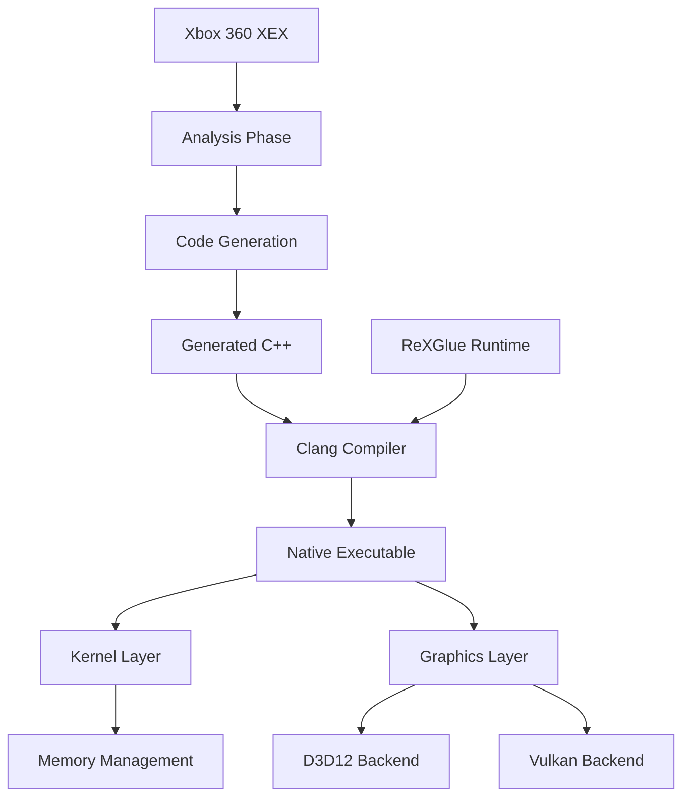

# Architecture Overview

ReXGlue is a complete static recompilation system that transforms Xbox 360 PowerPC executables into native C++ code. This page explains the core components and how they work together.

## System Architecture



## Core Components

### 1. Analysis Engine

The analysis engine (`src/codegen`) processes Xbox 360 executables to understand their structure:

- **Binary Parsing**: Reads XEX format files and extracts code sections, headers, and metadata
- **Function Discovery**: Identifies function boundaries using entry points, prologue patterns, and call analysis
- **Control Flow Analysis**: Builds control flow graphs to track jumps, branches, and switch tables
- **Data Region Detection**: Distinguishes embedded data from code using configurable thresholds

<Note>
  The analyzer can detect jump tables and switch statements automatically, but complex cases may require manual configuration via TOML hints.
</Note>

### 2. Code Generator

The code generator (`src/codegen`) translates PowerPC assembly to C++:

```cpp
// PowerPC instruction
lis r3, 0x8000      // Load immediate shifted
addi r3, r3, 0x100  // Add immediate

// Generated C++ (simplified)
ctx->r[3] = 0x80000000;
ctx->r[3] = ctx->r[3] + 0x100;
```

**Key features:**

- **Register Mapping**: PowerPC GPRs (r0-r31), FPRs (f0-f31), and special registers (LR, CTR, CR, XER)
- **Condition Flags**: Accurate CR field tracking for conditional branches
- **Exception Handling**: Optional SEH wrapper generation for Windows structured exception handling
- **Optimization**: Dead code elimination, register allocation, and local variable promotion

### 3. Runtime System

The runtime provides Xbox 360 environment emulation:

#### Processor (`rex::runtime::Processor`)

Manages execution state and module loading:

```cpp
class Processor {
  memory::Memory* memory() const;
  ExportResolver* export_resolver() const;
  
  bool AddModule(std::unique_ptr<Module> module);
  bool Execute(ThreadState* thread_state, uint32_t address);
  
  void SetFunction(uint32_t guest_address, PPCFunc* func);
  PPCFunc* GetFunction(uint32_t guest_address);
};
```

Location: `include/rex/system/processor.h:64-128`

#### Kernel State (`rex::system::KernelState`)

Emulates Xbox 360 kernel services:

```cpp
class KernelState {
  memory::Memory* memory() const;
  runtime::Processor* processor() const;
  VirtualFileSystem* file_system() const;
  
  ObjectTable* object_table();
  object_ref<XThread> LaunchModule(object_ref<UserModule> module);
  void RegisterThread(XThread* thread);
};
```

Location: `include/rex/system/kernel_state.h:111-254`

**Provides:**

- Thread management (XThread)
- Synchronization primitives (XEvent, XSemaphore, XMutant)
- File I/O and virtual filesystem
- Object handle table
- Module loading and symbol resolution

#### Memory Management (`rex::memory::Memory`)

Emulates Xbox 360 memory layout:

- **Physical Memory**: 512MB base allocation at fixed address
- **Virtual Memory**: Page table management with Xbox 360 addressing
- **Memory Mapping**: Support for memory-mapped I/O (MMIO) handlers
- **Big Endian**: Automatic endianness conversion for memory operations

<Warning>
  Memory is allocated at a fixed base address (`0x100000000` on x64) to maintain Xbox 360 pointer semantics. This requires specific compiler flags and may conflict with sanitizers.
</Warning>

### 4. Graphics Backends

ReXGlue translates Xbox 360 GPU commands to modern graphics APIs:

<Tabs>
  <Tab title="D3D12 (Windows)">
    **Direct3D 12 Backend** (`src/graphics/d3d12`)

    - Command list translation
    - Resource binding compatibility
    - Shader translation (HLSL)
    - Hardware-accelerated rendering

    Enabled by default on Windows via `REXGLUE_USE_D3D12=ON`
  </Tab>
  <Tab title="Vulkan (Linux)">
    **Vulkan Backend** (`src/graphics/vulkan`)

    - Cross-platform rendering
    - SPIR-V shader compilation
    - Validation layer support
    - RenderDoc integration

    Enabled by default on Linux via `REXGLUE_USE_VULKAN=ON`
  </Tab>
</Tabs>

### 5. Platform Abstraction

Platform-specific implementations:

| Component | Windows | Linux |
|-----------|---------|-------|
| **Window** | Win32 API | GTK |
| **Input** | XInput/DirectInput | evdev/SDL |
| **Audio** | XAudio2 | PulseAudio/ALSA |
| **Threading** | Win32 Threads | pthreads |
| **Filesystem** | NTFS paths | POSIX paths |

## Module Organization

The SDK is organized into layered modules:

```
rexglue-sdk/
├── src/core/          # Core types, logging, cvars
├── src/filesystem/    # VFS and file I/O
├── src/system/        # Kernel emulation (threads, objects, memory)
├── src/kernel/        # Kernel exports (xboxkrnl.exe)
├── src/graphics/      # GPU emulation (d3d12, vulkan)
├── src/ui/            # Windowing and presentation
├── src/input/         # Controller and keyboard input
├── src/audio/         # Audio emulation
├── src/codegen/       # Analysis and code generation
└── src/rexglue/       # CLI tool (init, codegen, migrate)
```

Each module is a CMake target that can be linked independently:

```cmake
target_link_libraries(my_recompiled_game PRIVATE
  rex::core      # Required: Logging, types, utilities
  rex::system    # Required: Processor, kernel state
  rex::kernel    # Required: Kernel exports (XThread, XFile, etc.)
  rex::graphics  # Optional: Graphics if game uses GPU
  rex::ui        # Optional: Windowing and ImGui overlays
)
```

## Configuration System

ReXGlue uses TOML configuration files for code generation:

```toml
project_name = "my_game"
file_path = "assets/default.xex"
out_directory_path = "generated"

# Code generation options
skip_lr = false
generate_exception_handlers = true
max_jump_extension = 65536

# Manual function overrides
[[functions]]
address = 0x82000100
name = "GameMain"
size = 0x500

# Jump table hints
[[switch_tables]]
address = 0x82001000
targets = [0x82001020, 0x82001040, 0x82001060]
```

Configuration structure: `include/rex/codegen/config.h:71-134`

## Build System Integration

ReXGlue integrates with CMake for seamless builds:

```cmake
# Find or add SDK
find_package(rexglue REQUIRED CONFIG)

# Add your sources + generated code
add_executable(my_game
  src/main.cpp
  ${GENERATED_SOURCES}  # From generated/sources.cmake
)

# Configure runtime and platform settings
rexglue_configure_target(my_game)

# Link runtime modules
target_link_libraries(my_game PRIVATE
  rex::core rex::system rex::kernel
)
```

The `rexglue_configure_target()` helper automatically:

- Links platform entry point
- Adds ReXApp framework code
- Configures graphics backend
- Sets compiler flags for Clang

## Next Steps

<CardGroup cols={2}>
  <Card
    title="Installation"
    icon="download"
    href="/installation"
  >
    Install the SDK and configure your toolchain
  </Card>
  <Card
    title="Quick Start"
    icon="rocket"
    href="/quickstart"
  >
    Create your first recompiled project
  </Card>
</CardGroup>
